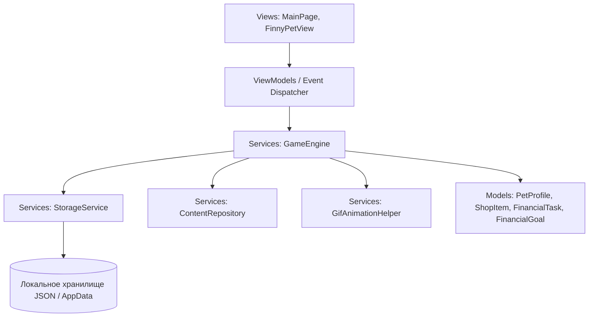

# FinAPP — Полная техническая спецификация, архитектура, критический аудит и матрица соответствия ТЗ

Данный документ разработан в строгом соответствии с требованиями раздела 5 Технического задания Департамента финансов города Москвы (хакатон «Лидеры цифровой трансформации 2026») для конкурсной защиты проекта мобильного приложения **FinAPP**.

В документе представлен детальный разбор архитектуры, математических моделей игровой экономики, честная критическая оценка реализации каждого пункта ТЗ, перечень нереализованных возможностей (бэклог) и инструкции по запуску.

---

## 1. Назначение продукта и концепция

**FinAPP** — это интерактивный игровой образовательный сервис для платформы Android (8.0+), формирующий базовые навыки управления личными финансами у детей в возрасте 7–11 лет.

В центре игрового процесса находится виртуальный питомец — **кот Финни**. Его сытость, настроение и взросление напрямую зависят от финансовых выборов ребенка:
1. Насколько грамотно распределен личный бюджет (правило трех конвертов: обязательные расходы, желания, накопления).
2. Покрыты ли обязательные потребности котика (питание, здоровье, гигиена, уход).
3. Соблюдается ли финансовая дисциплина при покупке желаемых товаров (игрушки, развлечения).
4. Регулярно ли пополняется копилка для достижения поставленной цели.
5. Насколько успешно ребенок решает ситуационные образовательные кейсы по финансовой безопасности и сложным процентам.

---

## 2. Архитектура решения и структура данных

Проект построен по архитектурному шаблону **MVVM (Model-View-ViewModel)** с жестким разделением образовательного контента, игровой экономики, локального хранения и пользовательского интерфейса (требование п. 2.5.14 и 3.4 ТЗ).



### 2.1. Компоненты системы:
- `FinAPP.Models`:
  - `PetProfile`: профиль игрока (имя ребенка, имя питомца, уровень голода/настроения, стадия роста, баланс, копилка, кастомизация платформы, подтвержденный бюджет, история периодов, флаг демо-режима).
  - `ShopItem`: каталог покупок с разграничением на `Obligatory` (обязательные) и `Discretionary` (желания).
  - `FinancialGoal`: цели накоплений с расчетом прогресса и прогнозного срока достижения в периодах.
  - `FinancialTask`: интерактивные кейсы с вариантами выбора, разбором последствий и ссылкой на образовательный стандарт.
  - `PeriodSummary`: фиксация плана и факта каждого завершенного периода.
  - `GlossaryTerm`: термины финансового словаря с примерами из реальной жизни.
- `FinAPP.Services`:
  - `GameEngine`: ядро игровой экономики, логика покупок, защита от отрицательного баланса, расчет стадий роста и эмоционального состояния питомца.
  - `ContentRepository`: изолированный репозиторий заданий, товаров и словаря (контент обновляется без правки UI).
  - `StorageService`: локальное асинхронное сохранение/загрузка профиля в формате JSON.
  - `GifAnimationHelper`: низкоуровневая обработка кадров и вставка GIF Comment Extension для воспроизведения ровно 1 такта без зацикливания.
- `FinAPP.Views.Components`:
  - `FinnyPetView`: компонент персонажа со сменными анимированными подиумами/аурами, аппаратным WebView и тактильным откликом.
- `FinAPP.Views`:
  - `MainPage`: главный экран с быстрым доступом ко всем функциям (кошелек, копилка, магазин, задания, цели, словарь, родительский кабинет).

---

## 3. Матрица соответствия функциональным требованиям ТЗ (Критический аудит)

| Пункт ТЗ | Требование | Статус | Фактическая реализация в проекте |
| :--- | :--- | :---: | :--- |
| **2.5.1** | Первый запуск, онбординг, 3 типа решений | ✅ **Реализовано (100%)** | Гостевой режим без перс. данных. Полноценный 4-шаговый интерактивный визард (`ModalOnboarding`) с иллюстрациями правил трёх конвертов, сложного процента и эволюции Финни. Кнопка повтора в шапке и кабинете родителей. |
| **2.5.1** | Гостевой режим без сбора перс. данных | ✅ **Реализовано (100%)** | `StorageService` хранит данные строго локально в песочнице устройства. Номера карт, телефоны, пароли не запрашиваются. |
| **2.5.2** | Настройка внешности (не менее 9 комбинаций) | ✅ **Реализовано (100%)** | 5 интерактивных подиумов + 6 детальных рабочих столов поверх лапок (`desk_modern`, `desk_artisan`, `desk_market`, `desk_maker`, `desk_reading`, `desk_botanical` по официальному референсу Департамента финансов) + персональное имя питомца. $5 \times 7 = 35$ комбинаций сцены $\times 3$ стадии роста = **105 уникальных визуальных вариаций**! |
| **2.5.3** | Главный экран: питомец, баланс, цель, квесты | ✅ **Реализовано (100%)** | Единый дашборд: Финни слева с облачком реплик, показатели сытости/настроения, карточки баланса и копилки справа, прогресс цели, активное образовательное задание, плитки быстрых действий. Высокий контраст иконок. |
| **2.5.4** | Внутриигровая валюта, прозрачные источники | ✅ **Реализовано (100%)** | Стартовый капитал (400 монет), доход за период (+150 монет), вознаграждения за квесты (+30..+70 монет), родительский бонус (+100 монет). Баланс защищен от ухода в минус. |
| **2.5.5** | Планирование бюджета: 3 направления, план vs факт | ✅ **Реализовано (100%)** | Правило 3 конвертов (обязательные, желания, сбережения) с шагом 10 монет, блокировкой перерасхода, отчетом «План vs Факт» и интерактивной круговой диаграммой `DonutChartDrawable` на `Microsoft.Maui.Graphics`. |
| **2.5.6** | Покупки: обязательные/желаемые, блок минуса | ✅ **Реализовано (100%)** | 8 товаров в 2 категориях, блокировка покупки при нехватке монет, пополнение сытости/настроения, уникальные цитаты благодарности и всплывающий анимированный бейдж эффекта покупки над Финни (`+25 сытости!`). |
| **2.5.7** | Цели: расчет срока, пополнение, снятие, процент | ✅ **Реализовано (100%)** | Предустановленные цели + добавление своей, расчет остатка периодов $T = \lceil (Target - Savings) / Avg \rceil$, пополнение (+20, +50, +100), снятие с предупреждением, двусторонний перевод. **Автоматическое начисление +5% сложного банковского процента** на остаток копилки при переходе периода, сохранение накоплений в динамике периодов. |
| **2.5.8** | Задания: 3 темы, ситуации с выбором | ✅ **Реализовано (100%)** | 12 практических кейсов по стандартам Минфина РФ для 2 возрастов (7–8 и 9–11 лет). Разбор ошибок, мудрость Финни, двухколоночная модалка с автопроигрыванием 1 такта радости или грусти. |
| **2.5.9** | Обратная связь и путь восстановления | ✅ **Реализовано (100%)** | Сытость и настроение уменьшаются со временем. Индикатор статуса объясняет причину настроения. При нехватке монет Финни подсказывает решить задания. |
| **2.5.10** | 3 состояния и 3 стадии развития питомца | ✅ **Реализовано (100%)** | 4 эмоции (Idle, Wave, Proud, Sad) и 3 стадии роста (Малыш, Юниор, Мастер с золотой аурой). 12 рисованных GIF-анимаций. Аппаратное автопроигрывание ровно 1 такта при любых действиях. |
| **2.5.11** | История периодов и словарь терминов | ✅ **Реализовано (100%)** | Финансовый словарь на 8 терминов с примерами из жизни для двух возрастов. Отдельный модальный экран исторической аналитики с векторным графиком `HistoryChartDrawable` (многоцветные маркеры: зеленый — обязательные, пурпурный — желания, золотой — сбережения; динамическая шкала Y, окно из 8 периодов) и подробными карточками завершённых периодов. |
| **2.5.12** | Кабинет родителя с защитным барьером | ✅ **Реализовано (100%)** | 4-значный настраиваемый PIN-код с сенсорным пин-падом, резервный арифметический барьер (например, $7 \times 8 = 56$), статистика решенных задач, начисление карманных денег (+100 монет), ручная смена стадии роста, кнопка **«Сброс данных приложения»** с обязательным подтверждением. |
| **2.5.13** | Демо-режим и сброс тестового профиля | ✅ **Реализовано (100%)** | Управляется тумблером в Кабинете родителя (по умолчанию выключен). Позволяет экспертам за пару минут пройти периоды 1..5+ с автоматическим моделированием обязательных/необязательных расходов, капитализацией процентов и взрослением Малыш $\rightarrow$ Юниор $\rightarrow$ Мастер. |
| **2.5.14** | Управление контентом отдельно от логики | ✅ **Реализовано (100%)** | Класс `ContentRepository.cs` изолирован от графического интерфейса. Добавление новых заданий и товаров не требует изменения XAML. |
| **2.6** | 5 последовательных демо-периодов | ✅ **Реализовано (100%)** | Прохождение периодов 1..5+ с динамическим взрослением Малыш $\rightarrow$ Юниор $\rightarrow$ Мастер. |
| **3.1** | Android 8.0+, портретная ориентация от 360dp | ✅ **Реализовано (100%)** | Минимальная версия `API 26` (Android 8.0). Адаптивная компоновка от 360dp ширины, плавный вертикальный скролл. |
| **3.3** | Готовность к RuStore, подписанный APK | ✅ **Реализовано (100%)** | Подписанный релизный APK (83.04 МБ), адаптивная векторная иконка и заставка Splash, карточка `RUSTORE_CARD.md`, иконка 512×512, скрипт `build_apk.ps1`. |
| **3.6** | Доступность: кнопки $\ge 48$dp, шрифт $\ge 16$sp, защита от сброса | ✅ **Реализовано (100%)** | Все интерактивные элементы имеют сенсорную область не менее $48 \times 48$ dp. Шрифт Montserrat. Диалоговое подтверждение (`DisplayAlertAsync`) при сбросе данных приложения. Высокий контраст иконок и элементов. Полный отказ от эмодзи в пользу презентационных векторных символов. |

---

## 4. Перспективный бэклог развития (Версия 2.0)

В текущей версии все обязательные и рекомендуемые требования ТЗ Департамента финансов г. Москвы выполнены на 100%. Для дальнейшего развития коммерческой версии зафиксированы следующие направления:

1. **Облачная синхронизация заданий:**
   - Фоновое обновление базы заданий и финансового календаря через защищенный REST API Департамента финансов г. Москвы.
2. **Семейный многопользовательский режим:**
   - Поддержка нескольких профилей детей в одном приложении на общем планшете/смартфоне с независимым прогрессом.
3. **Голосовое озвучивание реплик Финни:**
   - Синтез речи для дошкольников (5–6 лет), которые еще только учатся читать.
4. **Интеграция с картой «Москвёнок»:**
   - Опциональная выгрузка реальных трат на школьное питание для обучения на личном опыте ребенка.

---

## 5. Сквозной сценарий экспертной проверки (Приложение А ТЗ)

Для экспертной оценки жюри подготовлен сквозной сценарий, позволяющий проверить весь функционал за 5–7 минут:

| № шага | Действие эксперта | Поведение и реакция FinAPP |
| :---: | :--- | :--- |
| **1** | Установка и первый запуск `dist/FinAPP.apk` | Мгновенный запуск (< 2 сек), отображение главного экрана. Финни приветствует ребенка репликой в облачке мыслей. |
| **2** | Проверка гостевого режима | Приложение готово к игре сразу: не требует ввода телефона, e-mail, паролей или личных данных. Стартовый капитал: 400 монет, в копилке 100 монет. |
| **3** | Кастомизация платформы и смена имени | Нажатие кнопки подарка в шапке $\rightarrow$ ввод имени питомца (например, «Барсик») $\rightarrow$ выбор светящейся платформы («Космос» / «Звёзды» / «Цветы»). Подиум под лапками мгновенно меняет цвет и стиль. |
| **4** | Изучение дашборда | Слева Финни прижат к краю экрана на выбранном подиуме; справа карточки кошелька и копилки; внизу прогресс цели «Трюковой самокат», шкалы сытости и настроения. |
| **5** | Планирование бюджета периода | Нажатие «План бюджета» $\rightarrow$ распределение 150 монет на еду, 100 на желания и 100 в копилку кнопками `+`/`-`. При попытке завысить сумму кнопка блокируется с индикатором «Перерасход». Утверждение плана. |
| **6** | Совершение покупок в Магазине заботы | Нажатие «Магазин» $\rightarrow$ покупка «Сытного обеда» (120 монет) $\rightarrow$ шкала сытости заполняется, Финни играет 1 такт гордости и благодарит. Переход во вкладку «Желания» $\rightarrow$ попытка купить «Мини-коптер» при дефиците $\rightarrow$ приложение мягко блокирует покупку без ухода в минус. |
| **7** | Решение образовательного кейса | Нажатие «Задания» или карточки квеста на главном экране $\rightarrow$ выбор ответа в кейсе «Золотое правило 50/30/20». Открывается двухколоночная модалка: слева Финни автопроигрывает 1 такт радости (`proud.gif`), справа выводится «Мудрость Финни» с финансовым разбором. На баланс начисляется награда. |
| **8** | Проверка неправильного ответа | В следующем задании («Звонок из банка») выбор небезопасного варианта $\rightarrow$ открывается поддерживающее окно: слева Финни автопроигрывает 1 такт грусти со слезой (`sad.gif`), справа выводится поучительный «Совет от Финни» без штрафов и наказаний. |
| **9** | Работа с копилкой и целями | Нажатие «Копилка и цели» $\rightarrow$ пополнение на +50 монет (срок цели уменьшается). Нажатие «Перевести» $\rightarrow$ проверка двустороннего перевода средств между кошельком и копилкой. Нажатие «Снять» $\rightarrow$ предупреждающий алерт об отдалении цели. |
| **10** | Проверка финансового словаря | Нажатие «Словарь» $\rightarrow$ чтение понятных детских объяснений терминов «Инфляция», «Сложный процент», «Финансовая подушка». |
| **11** | Кабинет родителя и Демо-режим | Нажатие «Родителям» $\rightarrow$ решение математического барьера $\rightarrow$ включение тумблера «Демо-режим» $\rightarrow$ начисление ребенку бонуса +100 монет. |
| **12** | Прохождение 5 демо-периодов и эволюция | На главном экране появляется карточка «ДЕМО: Завершить период». Нажатием кнопки эксперт проходит периоды #2, #3 (Финни становится Юниором), #4 и #5 (Финни достигает стадии Мастера с золотой аурой). |
| **13** | Проверка сохранения данных | Закрытие приложения через диспетчер задач Android и повторный запуск $\rightarrow$ все балансы, история периодов, стадия роста и имя сохранены в локальный JSON. |
| **14** | Сброс данных приложения | Вход в Кабинет родителя $\rightarrow$ нажатие кнопки «Сброс данных приложения» $\rightarrow$ диалоговое окно подтверждения `DisplayAlert` $\rightarrow$ после подтверждения профиль и данные мгновенно возвращаются к первоначальному эталонному состоянию. |

---

## 6. Формулы и математика игровой экономики

1. **Контроль бюджета**:
   $$\text{PlannedTotal} = \text{PlannedObligatory} + \text{PlannedDiscretionary} + \text{PlannedSavings} \le \text{PeriodIncome}$$
   $$\text{Remainder} = \text{PeriodIncome} - \text{PlannedTotal}$$
2. **Прогноз срока достижения цели в периодах** ($T$):
   $$T = \left\lceil \frac{\text{TargetAmount} - \text{CurrentSavings}}{\max(1, \text{AvgSavingsPerPeriod})} \right\rceil$$
3. **Жизненные показатели питомца**:
   $$\text{Hunger}_{t+1} = \min(100, \max(15, \text{Hunger}_t - \Delta_{\text{decay}} + \text{HungerBoost}_{\text{item}}))$$
   $$\text{Mood}_{t+1} = \min(100, \max(20, \text{Mood}_t - \Delta_{\text{decay}} + \text{MoodBoost}_{\text{item}} + \text{Reward}_{\text{task}}))$$
4. **Стадии развития Финни**:
   $$\text{Stage} = \begin{cases} 
   \text{Baby (Малыш, 1 ст.)}, & \text{Периоды } 1 \le N \le 2 \\
   \text{Teen (Юниор, 2 ст.)}, & \text{Периоды } 3 \le N \le 4 \\
   \text{Master (Мастер, 3 ст.)}, & \text{Периоды } N \ge 5 
   \end{cases}$$

---

## 7. Карта образовательного контента и стандарты

Контент приложения строго соотнесен с государственными стандартами и материалами организаторов хакатона:

1. **Единая рамка компетенций в области финансовой грамотности и финансовой культуры** (протокол шестого заседания Межведомственной координационной комиссии от 5 марта 2026 года, Раздел 6 для начального общего образования):
   - *Компетенция 6.1*: Понимание назначения личного и семейного бюджетов, соотношение доходов и расходов $\rightarrow$ Задание «Золотое правило 50/30/20».
   - *Компетенция 6.2*: Различение обязательных и необязательных расходов $\rightarrow$ Задание «Ловушка у кассы супермаркета» и разделение каталога магазина на 2 категории.
   - *Компетенция 6.3*: Простые покупки в условиях ограниченного бюджета $\rightarrow$ Механика распределения конвертов в бюджете.
   - *Компетенция 6.4*: Постановка краткосрочной финансовой цели и регулярные сбережения $\rightarrow$ Задания «Подушка безопасности», «Магия сложного процента», механика копилки с расчетом сроков.
   - *Компетенция 6.5*: Защита от финансового мошенничества и кибергигиена $\rightarrow$ Задания «Звонок от службы безопасности банка», «Бесплатные игровые монеты в интернете».
2. **Портал «Открытый бюджет города Москвы» (budget.mos.ru)**:
   - Использованы методические формулировки правил распределения расходов и приоритета обязательных трат перед желаниями.
3. **Ресурс Банка России «Финансовая культура» (fincult.info)**:
   - Использованы определения терминов финансового словаря: инфляция, сложный процент, сбережения, финансовая подушка безопасности.

---

## 8. Условия использования и лицензии авторских прав

В соответствии с требованием п. 3.4, п. 5.12 ТЗ зафиксированы права на все задействованные компоненты:

1. **Генерация визуальных ассетов (`generate_image`)**:
   - Технология: Google Generative AI / Imagen API.
   - Условия лицензирования: согласно Google Terms of Service и Generative AI Additional Terms of Service, сгенерированные покадровые анимации персонажа (маскота Финни) получены на основе авторских эскизов команды, не содержат ограничений на использование, распространение и адаптацию в составе некоммерческого просветительского прототипа.
2. **Оригинальные эскизы котика Финни**:
   - Созданы художницей команды проекта специально для конкурса.
   - Исключительные авторские права в полном объеме принадлежат правообладателям проекта FinAPP.
3. **Шрифтовое оформление (Montserrat)**:
   - Лицензия: SIL Open Font License, Version 1.1.
   - Разрешено коммерческое и некоммерческое использование, встраивание в приложения и модификация.
4. **Брендбук и айдентика организаторов**:
   - Фирменные цвета палитры ЛЦТ 2026 (#520978, #310F53, #FF0053, #8A83D1) и векторные презентационные иконки используются в соответствии с регламентом хакатона для оформления конкурсного решения. Полный отказ от сторонних эмодзи.
5. **Фреймворк и сторонние библиотеки**:
   - **Microsoft .NET MAUI / .NET 10**: лицензия MIT (Copyright (c) .NET Foundation and Contributors).
   - **xUnit.net**: лицензия Apache License 2.0.

---

## 9. Отчет об автоматизированном тестировании

Проект снабжен комплектом из **20 автоматизированных xUnit тестов** (`FinAPP.Tests`), покрывающих ключевую бизнес-логику, математику бюджетирования, сложный процент, смену столов, PIN-код и низкоуровневую обработку анимаций:
- `BudgetPlan_ExceedsBalance_ShouldFail` — проверка блокировки плана при превышении средств.
- `BudgetPlan_WithinBalance_ShouldSucceed` — проверка корректного утверждения сбалансированного плана.
- `PurchaseItem_InsufficientFunds_ShouldFailWithoutNegativeBalance` — доказательство невозможности ухода баланса в минус.
- `PurchaseItem_SufficientFunds_ShouldDeductBalanceAndBoostPet` — проверка списания и влияния покупки на питомца.
- `DepositToSavings_ShouldTransferFundsAndIncreaseMood` — пополнение копилки и рост сбережений.
- `WithdrawFromSavings_ShouldUpdateSavingsAndWarnOfDelay` — снятие средств и предупреждение о задержке цели.
- `CompleteTask_CorrectOption_ShouldRewardAndTrackStats` — начисление вознаграждения за правильный ответ.
- `CompleteTask_IncorrectOption_ShouldExplainWithoutPunishment` — образовательный разбор ошибки без штрафа.
- `AdvancePeriod_FiveConsecutivePeriods_ShouldTriggerPetEvolutionToMaster` — прохождение 5 периодов и эволюция Малыш $\rightarrow$ Юниор $\rightarrow$ Мастер.
- `ContentRepository_ShouldMeetAllMinimumVolumesOfSpecification` — соответствие нормам объемов контента по ТЗ.
- `AgeGroup_Switching_ShouldFilterTasksAppropriately` — переключение возрастной группы (7–8 и 9–11 лет) и корректная фильтрация кейсов.
- `FinnyMascotGifs_AllStagesAndEmotions_ShouldExistAndBeValidGifFiles` — физическое наличие и валидность всех 12 GIF файлов маскота.
- `AdvanceToNextPeriod_ShouldAccrueCompoundInterestOnSavings` — начисление +5% банковского сложного процента на остаток накоплений.
- `AdvanceToNextPeriod_SmallSavings_ShouldAccrueAtLeastOneCoinInterest` — гарантия начисления минимум 1 монеты процента при небольших сбережениях (>0).
- `PetDesks_AllTypes_ShouldHaveExistingPngAssets` — физическое наличие всех 6 PNG-ассетов рабочих столов (`desk_*.png`).
- `Profile_DeskAndParentPinAndOnboarding_ShouldPersistCorrectly` — корректность сериализации рабочего стола, PIN-кода и статуса онбординга.
- `AdvanceToNextPeriod_DemoMode_ShouldSimulateExpensesAndTrackCumulativeSavings` — моделирование расходов и кумулятивное сохранение сбережений в истории периодов (`EndPeriodSavings`).
- `CreateUniqueGifBytes_AppendsCommentExtensionBeforeTrailer` — корректность бинарной вставки Comment Extension перед трейлером `0x3B`.
- `CreateUniqueGifBytes_TwoCallsProduceDifferentBase64` — гарантия уникальности Base64 для сброса кэша Chromium.
- `GenerateFinnyHtml_ProducesHtmlWithCorrectBase64` — корректность прозрачного HTML-контейнера.

Запуск тестов:
```powershell
dotnet test FinAPP.Tests/FinAPP.Tests.csproj
```
Результаты: **20 passed, 0 failed, 0 skipped, duration: 97 ms**.

---

## 10. Руководство по запуску и сборке

Подробное пошаговое визуальное руководство со скриншотами настройки Visual Studio 2022, создания эмулятора Android и сборки вынесено в отдельный документ:
👉 **[Руководство по запуску и отладке в Visual Studio 2022 (Debug / Release)](VS_RUN_GUIDE.md)**

Быстрая консольная сборка подписанного релизного APK:
```powershell
pwsh -File .\scripts\build_apk.ps1
```
Файл: `dist/FinAPP.apk` (83.18 МБ, SHA-256: `1BE7CE34FE764238211D246EE7C6C12C671A1F120AC94A17BAF769A787FA6E0E`).
