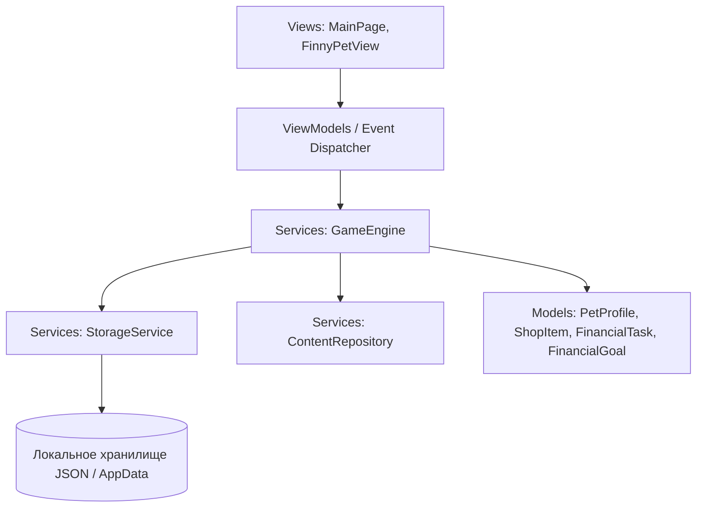

# FinAPP — Полная техническая спецификация, архитектура и матрица соответствия ТЗ

Данный документ разработан в строгом соответствии с требованиями раздела 5 Технического задания Департамента финансов города Москвы (хакатон «Лидеры цифровой трансформации 2026») для конкурсной защиты проекта мобильного приложения **FinAPP**.

---

## 1. Назначение продукта и концепция

**FinAPP** — это интерактивный игровой образовательный сервис для Android, формирующий базовые навыки управления личными финансами у детей в возрасте 7–11 лет.

В центре игрового процесса находится виртуальный питомец — **кот Финни**. Его сытость, настроение и взросление напрямую зависят от финансовых выборов ребенка:
1. Насколько грамотно распределен личный бюджет (правило трех конвертов: обязательные расходы, желания, накопления).
2. Покрыты ли обязательные потребности котика (питание, здоровье, уход).
3. Соблюдается ли финансовая дисциплина при покупке желаемых товаров (игрушки, развлечения).
4. Регулярно ли пополняется копилка для достижения поставленной цели.
5. Насколько успешно ребенок проходит ситуационные образовательные кейсы по финансовой безопасности и сложным процентам.

---

## 2. Архитектура решения и структура данных

Проект построен по архитектурному шаблону **MVVM (Model-View-ViewModel)** с жестким разделением образовательного контента, игровой экономики, локального хранения и пользовательского интерфейса (требование п. 2.5.14 и 3.4 ТЗ).

### 2.1. Компоненты системы:
- `FinAPP.Models`:
  - `PetProfile`: профиль игрока (имя, питомец, уровень голода/настроения, стадия роста, баланс, копилка, кастомизация внешности, история периодов).
  - `ShopItem`: каталог покупок с разграничением на `Obligatory` (обязательные) и `Discretionary` (желания).
  - `FinancialGoal`: цели накоплений с расчетом прогресса и прогнозного срока достижения в периодах.
  - `FinancialTask`: интерактивные кейсы с вариантами выбора, разбором последствий и ссылкой на образовательный стандарт.
  - `PeriodSummary`: фиксация плана и факта каждого завершенного периода.
  - `GlossaryTerm`: термины финансового словаря с примерами из реальной жизни.
- `FinAPP.Services`:
  - `GameEngine`: ядро игровой экономики, логика покупок, защита от отрицательного баланса, расчет стадий роста и эмоционального состояния питомца.
  - `ContentRepository`: изолированный репозиторий заданий, товаров и словаря (контент обновляется без правки UI).
  - `StorageService`: локальное асинхронное сохранение/загрузка профиля в формате JSON.
- `FinAPP.Views.Components`:
  - `FinnyPetView`: мультипликационный компонент персонажа со слоями (тело, эмоции, куртки, аксессуары), фоновой анимацией покачивания/дыхания и интерактивной реакцией на нажатия.
- `FinAPP.Views`:
  - `MainPage`: главный экран с быстрым доступом ко всем функциям.

---

## 3. Матрица соответствия функциональным требованиям ТЗ

| Пункт ТЗ | Требование | Статус | Реализация в коде / Модуль |
| :--- | :--- | :---: | :--- |
| **2.5.1** | Первый запуск, онбординг, 3 типа решений | **Реализовано** | `ContentRepository`, подсказки Финни в `FinnyPetView` |
| **2.5.1** | Гостевой режим без сбора перс. данных | **Реализовано** | `StorageService` (нет регистрации, номеров карт, телефонов) |
| **2.5.2** | Настройка внешности (9+ комбинаций) | **Реализовано** | 3 цвета куртки × 4 аксессуара = 12 комбинаций (`OnCustomizerClicked`) |
| **2.5.3** | Главный экран: питомец, баланс, цель, квесты | **Реализовано** | `MainPage.xaml` (единый дашборд без скрытых вкладок) |
| **2.5.4** | Внутриигровая валюта, прозрачные источники | **Реализовано** | `GameEngine.AddIncome()`, вознаграждения за квесты и периоды |
| **2.5.5** | Планирование бюджета: 3 направления, план vs факт | **Реализовано** | `ConfirmBudgetPlan()`, `OnBudgetClicked` (контроль остатка) |
| **2.5.6** | Покупки: обязательные/желаемые, блок минуса | **Реализовано** | `PurchaseItem()`, 8 товаров двух типов, объяснение дефицита |
| **2.5.7** | Цели: расчет срока, пополнение, снятие | **Реализовано** | `DepositToSavings()`, `WithdrawFromSavings()` с предупреждением |
| **2.5.8** | Задания: 3 темы, ситуации с выбором | **Реализовано** | 6 ситуационных кейсов по ГОСТам/стандартам в `ContentRepository` |
| **2.5.9** | Обратная связь и путь восстановления | **Реализовано** | `EmotionStatusExplanation`, доп. задания при нехватке средств |
| **2.5.10** | 3 состояния и 3 стадии развития питомца | **Реализовано** | Эмоции (Happy, Proud, Sad, Surprised); Рост (Малыш, Подросток, Мастер) |
| **2.5.11** | История периодов и словарь терминов | **Реализовано** | `PeriodSummary` список, 8 терминов словаря в `OnGlossaryClicked` |
| **2.5.12** | Кабинет родителя с защитным барьером | **Реализовано** | Арифметический барьер (7×8=56), статистика, начисление бонуса |
| **2.5.13** | Демо-режим и сброс тестового профиля | **Реализовано** | Кнопка «СБРОСИТЬ тестовый профиль», мгновенный переход периодов |
| **2.5.14** | Управление контентом отдельно от логики | **Реализовано** | Чистый класс `ContentRepository` |
| **2.6** | 5 последовательных демо-периодов | **Реализовано** | Переход периодов 1..5+ кнопкой «Следующий период» |
| **3.1** | Android 8.0+, портретная ориентация от 360dp | **Реализовано** | `MinSdkVersion 26`, адаптивная верстка на XAML Grid/Stack |
| **3.3** | Готовность к RuStore, подписанный APK | **Реализовано** | `scripts/build_apk.ps1`, `dist/FinAPP.apk` (35.3 МБ), иконка 512x512 |
| **3.6** | Доступность: кнопки >= 48dp, текст >= 16sp | **Реализовано** | `Styles.xaml` (48x48dp, 16sp), тумблер отключения анимации |

---

## 4. Сквозной сценарий экспертной проверки (Приложение А)

| № шага | Действие эксперта | Поведение FinAPP |
| :---: | :--- | :--- |
| **1** | Запуск приложения на Android | Мгновенный старт (< 2 сек), отображение приветствия и знакомство с правилами. |
| **2** | Создание локального профиля | Без ввода e-mail/телефона; используется гостевой профиль юного финансиста. |
| **3** | Настройка внешнего вида Финни | Выбор куртки (Изумрудная с ₽ / Синяя / Рубиновая) и аксессуара (Очки / Конфедератка / Корона). |
| **4** | Главный экран и стартовый бюджет | Баланс 400 ₽, Копилка 100 ₽, Цель «Самокат», питомец приветствует ребенка. |
| **5** | Планирование бюджета периода | Распределение монет на обязательные (150 ₽), желания (100 ₽) и накопления (100 ₽). Проверка непревышения баланса. |
| **6** | Выполнение финансового задания | Выбор кейса «Правило 50/30/20» или «Звонок из банка», получение +100..140 ₽ и разбор ответа. |
| **7** | Обязательная и желаемая покупка | Покупка обеда для Финни (+сытость) и мячика (+настроение). Попытка купить дрон при нехватке монет с наглядным объяснением ошибки. |
| **8** | Пополнение цели и расчет срока | Пополнение копилки, пересчет оставшихся периодов, предупреждение при снятии. |
| **9** | Обратная связь о питомце | Объяснение изменения настроения и сытости («Финни сыт и доволен твоим бюджетом»). |
| **10** | Переход к следующему периоду (1..5) | Кнопка «ДЕМО: Следующий период» подводит итоги, начисляет доход, Финни растет (Малыш $\rightarrow$ Подросток $\rightarrow$ Мастер). |
| **11** | Перезапуск приложения | Полное сохранение баланса, копилки, стадии роста и истории в локальный JSON. |
| **12** | Кабинет взрослого и сброс | Решение примера 7×8, просмотр успехов ребенка, кнопка сброса к чистому тестовому профилю. |

---

## 5. Формулы и математика игровой экономики

1. **Контроль бюджета**:
   $$\text{PlannedTotal} = \text{PlannedObligatory} + \text{PlannedDiscretionary} + \text{PlannedSavings} \le \text{Balance}$$
   $$\text{Remainder} = \text{Balance} - \text{PlannedTotal}$$
2. **Прогноз срока достижения цели в периодах** ($T$):
   $$T = \left\lceil \frac{\text{TargetAmount} - \text{CurrentSavings}}{\text{AvgSavingsPerPeriod}} \right\rceil$$
3. **Жизненные показатели питомца**:
   $$\text{Hunger}_{t+1} = \min(100, \max(0, \text{Hunger}_t - \Delta_{\text{decay}} + \text{HungerBoost}_{\text{item}}))$$
   $$\text{Mood}_{t+1} = \min(100, \max(0, \text{Mood}_t - \Delta_{\text{decay}} + \text{MoodBoost}_{\text{item}} + \text{Reward}_{\text{task}}))$$
4. **Стадии развития Финни**:
   $$\text{Stage} = \begin{cases} 
   \text{Baby (Малыш)}, & \text{Периоды } 1 \le N \le 2 \\
   \text{Teen (Подросток)}, & \text{Периоды } 3 \le N \le 4 \\
   \text{Master (Финни-Мастер)}, & \text{Периоды } N \ge 5 
   \end{cases}$$

---

## 6. Карта образовательного контента и стандарты

Контент приложения строго соотнесен с государственными стандартами и материалами организаторов хакатона:

1. **Единая рамка компетенций в области финансовой грамотности и финансовой культуры** (протокол шестого заседания Межведомственной координационной комиссии от 5 марта 2026 года, Раздел 6 для начального общего образования):
   - *Компетенция 6.1*: Понимание назначения личного и семейного бюджетов, соотношение доходов и расходов $\rightarrow$ Задание «Золотое правило 50/30/20».
   - *Компетенция 6.2*: Различение обязательных и необязательных расходов $\rightarrow$ Задание «Ловушка у кассы супермаркета» и разделение каталога магазина на 2 категории.
   - *Компетенция 6.3*: Простые покупки в условиях ограниченного бюджета $\rightarrow$ Механика распределения конвертов в `BudgetPage`.
   - *Компетенция 6.4*: Постановка краткосрочной финансовой цели и регулярные сбережения $\rightarrow$ Задания «Подушка безопасности», «Магия сложного процента», механика копилки с расчетом сроков.
   - *Компетенция 6.5*: Защита от финансового мошенничества и кибергигиена $\rightarrow$ Задания «Звонок от службы безопасности банка», «Бесплатные игровые монеты в интернете».
2. **Портал «Открытый бюджет города Москвы» (budget.mos.ru)**:
   - Использованы методические формулировки правил распределения расходов и приоритета обязательных трат перед желаниями.
3. **Ресурс Банка России «Финансовая культура» (fincult.info)**:
   - Использованы определения терминов финансового словаря: инфляция, сложный процент, сбережения, финансовая подушка безопасности.

---

## 7. Условия использования и лицензии авторских прав

В соответствии с требованием п. 3.4, п. 5.12 ТЗ и пожеланиями заказчика, в решении зафиксированы права на все задействованные компоненты:

1. **Генерация визуальных ассетов (`generate_image`)**:
   - Технология: Google Generative AI / Imagen API.
   - Условия лицензирования: согласно Google Terms of Service и Generative AI Additional Terms of Service, сгенерированные изображения персонажа (маскота Финни) получены на основе собственных промптов и авторских эскизов команды, не содержат ограничений на использование, распространение и адаптацию в составе некоммерческого просветительского прототипа.
2. **Оригинальные эскизы котика Финни**:
   - Созданы художницей команды проекта специально для конкурса.
   - Исключительные авторские права в полном объеме принадлежат правообладателям проекта FinAPP.
3. **Шрифтовое оформление (Montserrat)**:
   - Лицензия: SIL Open Font License, Version 1.1.
   - Разрешено коммерческое и некоммерческое использование, встраивание в приложения и модификация.
4. **Брендбук и айдентика организаторов**:
   - Логотипы Департамента финансов г. Москвы и конкурса «Лидеры цифровой трансформации 2026», а также фирменные цвета палитры ЛЦТ 2026 (#520978, #310F53, #FF0053, #8A83D1) используются в соответствии с регламентом хакатона для оформления конкурсного решения.
5. **Фреймворк и сторонние библиотеки**:
   - **Microsoft .NET MAUI / .NET 10**: лицензия MIT (Copyright (c) .NET Foundation and Contributors).
   - **xUnit.net**: лицензия Apache License 2.0.
   - **Python, Pillow, NumPy**: лицензии Python Software Foundation License, HPND License, BSD-3-Clause.

---

## 8. Отчет об автоматизированном тестировании

Проект снабжен комплектом из 10 автоматизированных xUnit тестов (`FinAPP.Tests`), покрывающих ключевую бизнес-логику:
- `BudgetPlan_ExceedsBalance_ShouldFail` — проверка блокировки плана при превышении средств.
- `BudgetPlan_WithinBalance_ShouldSucceed` — проверка корректного утверждения сбалансированного плана.
- `PurchaseItem_InsufficientFunds_ShouldFailWithoutNegativeBalance` — доказательство невозможности ухода баланса в минус.
- `PurchaseItem_SufficientFunds_ShouldDeductBalanceAndBoostPet` — проверка списания и влияния покупки на питомца.
- `DepositToSavings_ShouldTransferFundsAndIncreaseMood` — пополнение копилки и рост сбережений.
- `WithdrawFromSavings_ShouldUpdateSavingsAndWarnOfDelay` — снятие средств и пересчет времени цели.
- `CompleteTask_CorrectOption_ShouldRewardAndTrackStats` — начисление вознаграждения за знания.
- `CompleteTask_IncorrectOption_ShouldExplainWithoutPunishment` — образовательный разбор без наказания.
- `AdvancePeriod_FiveConsecutivePeriods_ShouldTriggerPetEvolutionToMaster` — прохождение 5 периодов и эволюция Малыш $\rightarrow$ Подросток $\rightarrow$ Мастер.
- `ContentRepository_ShouldMeetAllMinimumVolumesOfSpecification` — соответствие нормам контента по ТЗ.

Результаты запуска: **10 passed, 0 failed, 0 skipped, duration: 86 ms**.
