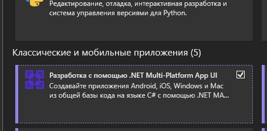
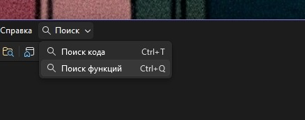
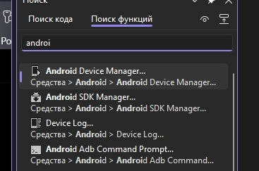
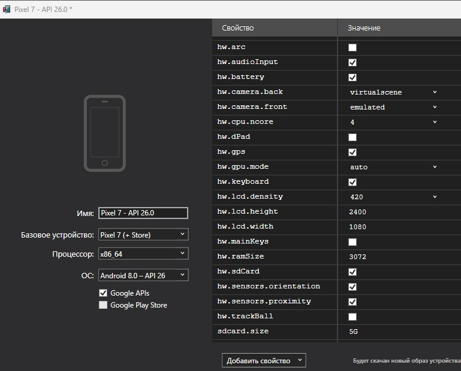
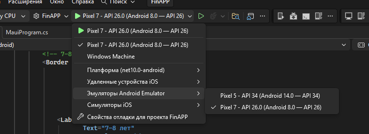

# Руководство по запуску и отладке FinAPP в Visual Studio 2022 (Debug и Release)

Данное руководство содержит пошаговые инструкции по настройке окружения, созданию эмулятора Android, запуску проекта в режимах **Debug** (отладка) и **Release** (релиз), а также сборке подписанного APK-пакета в среде **Microsoft Visual Studio 2022**.

---

## 1. Проверка компонентов Visual Studio Installer

Для сборки и запуска .NET MAUI проектов на платформе Android требуется установленная рабочая нагрузка мобильной разработки.

1. Откройте **Visual Studio Installer**.
2. Нажмите кнопку **«Изменить»** (Modify) рядом с установленной версией Visual Studio 2022 (Community / Professional / Enterprise).
3. Во вкладке **«Рабочие нагрузки»** найдите раздел **«Классические и мобильные приложения»**.
4. Убедитесь, что установлен флажок напротив компонента **«Разработка с помощью .NET Multi-Platform App UI» (.NET MAUI)**:



5. Если компонент не был установлен — отметьте его и нажмите **«Изменить»** в правом нижнем углу для завершения установки.

---

## 2. Создание и настройка эмулятора Android (Android Device Manager)

Приложение FinAPP оптимизировано для работы на Android версии **8.0 (API 26)** и выше. Рекомендуется использовать официальный системный образ `x86_64` с поддержкой Google APIs.

### Шаг 2.1: Быстрый вызов Диспетчера устройств Android
1. В верхнем правом углу Visual Studio нажмите на строку поиска или нажмите сочетание клавиш **`Ctrl + Q`**:



2. Введите запрос `androi`:
3. В выпадающем списке выберите пункт **«Android Device Manager...»** (*Средства $\rightarrow$ Android $\rightarrow$ Android Device Manager...*):



### Шаг 2.2: Конфигурация виртуального устройства (AVD)
В открывшемся окне нажмите **«Создать»** (New) и задайте параметры устройства, идентичные эталонной конфигурации проекта:



- **Имя устройства (Name):** `Pixel 7 - API 26.0`
- **Базовое устройство (Base Device):** `Pixel 7 (+ Store)`
- **Процессор (Processor):** `x86_64` (обеспечивает максимальную скорость работы на ПК с аппаратной виртуализацией Intel HAXM / Windows Hypervisor Platform)
- **Операционная система (OS):** `Android 8.0 - API 26` (минимальная поддерживаемая версия согласно ТЗ хакатона)
- **Google APIs:** Включено (флажок установлен)
- **Оперативная память (RAM):** `3072 MB`
- **Внутренняя память (SD card):** `5 GB`
- **Графический акселератор (hw.gpu.mode):** `auto` (аппаратное ускорение)

Нажмите кнопку **«Создать»** (Create). При первом создании Visual Studio загрузит официальный образ Android SDK. После завершения нажмите кнопку **«Пуск»** для тестового старта эмулятора.

---

## 3. Запуск проекта в режиме отладки (DEBUG)

Режим **Debug** предназначен для повседневной разработки: поддерживаются точки останова (Breakpoints), инспекция переменных, дерево визуальных элементов Live Visual Tree и горячая перезагрузка интерфейса XAML Hot Reload.

### Порядок действий:
1. Откройте файл решения `FinAPP.slnx` в Visual Studio 2022.
2. На верхней панели инструментов переключите конфигурацию сборки в **`Debug`**.
3. В выпадающем списке целевых платформ и эмуляторов раскройте меню и выберите созданный эмулятор **`Pixel 7 - API 26.0 (Android 8.0 — API 26)`**:



4. Для запуска с отладчиком нажмите клавишу **`F5`** (или зеленую стрелку *«Pixel 7 - API 26.0»* на панели инструментов).
5. Для быстрого запуска без прикрепления отладчика используйте **`Ctrl + F5`**.
6. Visual Studio автоматически развернет APK на эмуляторе и запустит главный экран приложения с питомцем Финни.

---

## 4. Сборка и запуск в релизном режиме (RELEASE)

Режим **Release** компилирует приложение с максимальной оптимизацией кода, включенным AOT-компилятором, сжатием байт-кода и уменьшением размера бандла.

### Способ 1: Запуск в Visual Studio
1. На панели инструментов переключите выпадающий список конфигурации с `Debug` на **`Release`**.
2. Убедитесь, что в качестве цели выбран `Pixel 7 - API 26.0 (Android 8.0 — API 26)` или физический Android-смартфон, подключенный по USB (в режиме отладки по USB).
3. Нажмите **`Ctrl + F5`** (Запуск без отладки). Приложение скомпилируется в оптимизированном релизном виде и запустится на устройстве.

### Способ 2: Автоматическая сборка подписанного APK через терминал (Рекомендуется)
Для создания готового автономного APK-пакета, подписанного криптографическим ключом RSA 2048-bit и готового к установке на любые смартфоны или загрузке в RuStore:

1. Откройте терминал PowerShell в корне репозитория.
2. Выполните скрипт сборки:
```powershell
pwsh -File .\scripts\build_apk.ps1
```
3. Скрипт проверит/сгенерирует релизный keystore `dist/finapp_release.keystore`, выполнит `dotnet publish -f net10.0-android -c Release` с перенаправлением промежуточных артефактов в системный `TEMP` (исключая превышение длины путей Windows) и скопирует готовый файл в:
```text
dist/FinAPP.apk (размер 82.25 МБ, архитектуры arm64-v8a, armeabi-v7a, x86_64)
```

### Способ 3: Графическая публикация через Visual Studio
1. В Обозревателе решений щелкните правой кнопкой мыши по проекту **`FinAPP`**.
2. Выберите пункт **«Опубликовать...»** (Publish).
3. В мастере публикации выберите целевую платформу `net10.0-android`.
4. В качестве хранилища ключей укажите существующий `dist/finapp_release.keystore` (пароль хранилища и ключа: `FinAppPass2026!`, псевдоним: `finapp`).
5. Нажмите **«Создать распределение»** для генерации релизного APK/AAB.

---

## 5. Типичные проблемы и их решение

| Проблема | Причина | Решение |
| :--- | :--- | :--- |
| Эмулятор не запускается или сообщает об ошибке Hyper-V | Отключена аппаратная виртуализация | Включите *«Платформа гипервизора Windows»* и *«Песочница Windows»* в компонентах Windows, либо проверьте включение Intel VT-x / AMD-V в BIOS. |
| Ошибка пути `PathTooLongException` при сборке | Длинные пути в OneDrive/Документы | Скрипт `build_apk.ps1` автоматически перенаправляет `obj` и `bin` в `%TEMP%\FinAPP`. При сборке вручную используйте флаг `-p:IntermediateOutputPath=%TEMP%\FinAPP\obj\`. |
| Эмулятор отображает черный экран | Несовместимость GPU драйвера | В Android Device Manager для устройства смените параметр `hw.gpu.mode` с `auto` на `mesa` или `angle`. |
